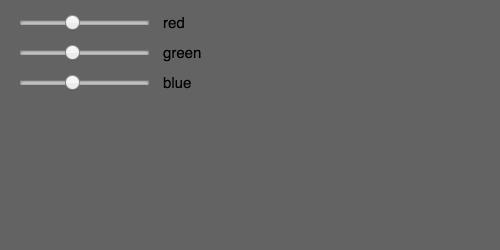
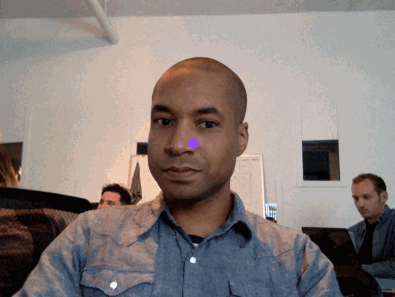
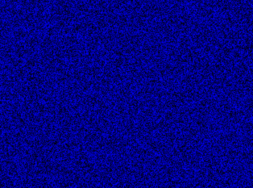
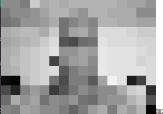
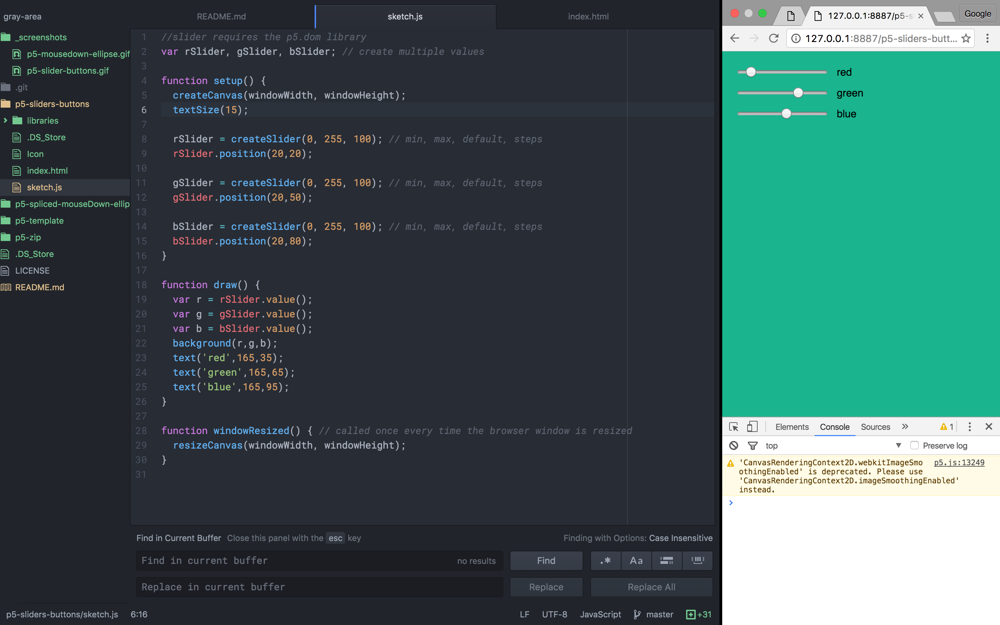

# Gray Area
Sandbox for Gray Area exercises.

### p5-spliced-mouseDown

### p5-slider-buttons

### p5-video-clmtracker

### p5-video-static

### p5-video-grayscale

Certain p5.js methods and properties exist outside p5.js core and require including the [p5.dom library](https://p5js.org/reference/#/libraries/p5.dom).

Including the block below in `index.html` allowed us to extend the library.
~~~~

~~~~

### Environment
I quickly abandoned the [p5.js editor](https://p5js.org/download/) (v0.6.1), a Safari webapp that, at the time of this writing, lacks features like autocomplete. My current environment consists of [Atom](https://atom.io/), [Chrome Canary](https://www.google.com/chrome/browser/canary.html) and its [Developer Tools](https://developer.chrome.com/devtools), [Web Server for Chrome](https://chrome.google.com/webstore/detail/web-server-for-chrome/ofhbbkphhbklhfoeikjpcbhemlocgigb?hl=en), and [Git](https://git-scm.com/) in the command line.

**Atom** doesn't have a p5.js autocomplete package yet, but its other autocomplete packages are beginning to help autofill p5.js more and more as I continue to code.

**Chrome Canary** and it's cousins, [Safari Technology Preview](https://webkit.org/downloads/) and [Firefox Nightly](https://nightly.mozilla.org/) contain useful experimental features and web technologies that Safari (stable) has yet to incorporate.

Pinning my text editor and browser with macOS' [Split View](https://support.apple.com/en-us/HT204948) makes for a decent IDE.

### sketch.js Template
Added `function windowResized()` to my template project, which allows for viewport agnostic responsive design.

~~~
function setup() {
  createCanvas(windowWidth, windowHeight);
}

function draw() {

}

function windowResized() { // called once every time the browser window is resized
  resizeCanvas(windowWidth, windowHeight);
}
~~~

### About Gray Area
[Gray Area Foundation for the Arts, Inc.](http://grayarea.org/) is a 501(c)3 non-profit organization supporting art and technology for social good.

### Resources
GIFs created with [LiceCap](http://www.cockos.com/licecap/), sized at 500x250p.
